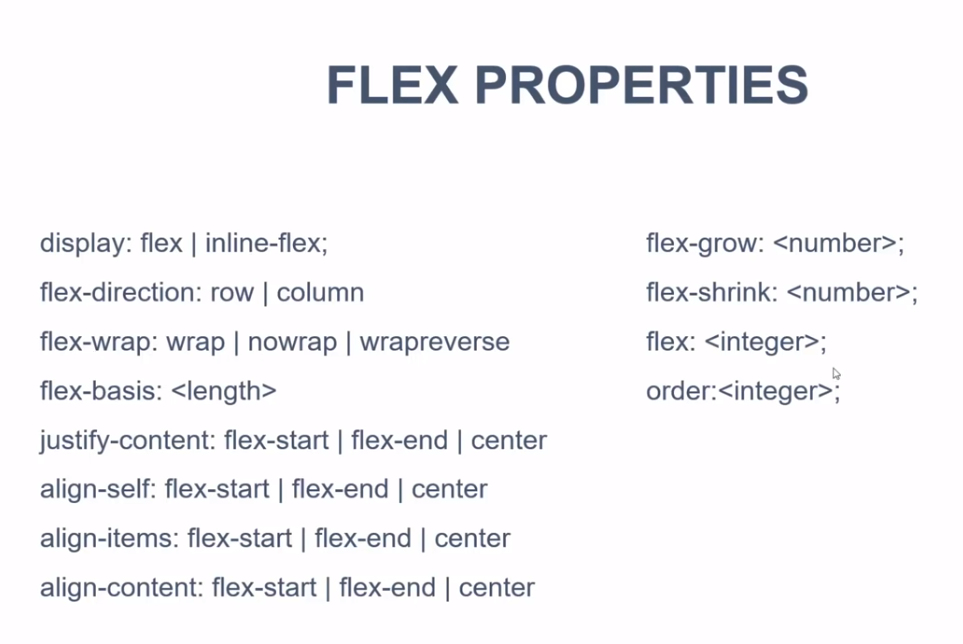

# CSS 3 CHEAT SHEET

## Reset

```
*{
    margin:0;
    padding:0;
}
```

## Fonts

Use `font-family` to change the styling of the font. Default is Times New Roman.</br></br>

</br></br>
Use `font-weight:bold` to make it BOLD.</br>
Use `font-size` to change the size.

Instead of doing
</br>

```
body{
    font-weight: normal;
    font-size: 16px;
    font-family: Arial, Helvetica, sans-serif;
}
```

we could actually use a shorthand notation.
Use:
</br>

```
body{
    font: normal, 16px, Arial, helvetica, sans-serif;
}
```

</br>

Use `line-height` to increase/decrease the line height (space b/w two lines in the text). Usually, use em as a measure instead of px, although px is doable too. em is just for more responsive sites.

```
body{
    line-height: 1.6em;
}
```

</br></br>

Text Transform, Text Decoration, Spacing and Font Style:

```
.box-1 h1{
    font-style: italic;
    text-decoration: underline;
    text-transform: uppercase;
    letter-spacing: 0.2 em;
    word-spacing: 1em;
    line-spacing: 1.16em;
}

```

## Box Model


## Centering DIVs / elements:

wrap the elements in a new `div` tag and give it a class name. Let's call this class as `container` for instance.
</br>
Now create a new style with the class name and enforce the rule of margin.
</br>

```
.container{
    width : 80%;
    /* to not to make it go all the way across the page */
    margin: auto;
}
```


</br>

## Margins

Shorthand notations goes like:
margin-top margin-right margin-bottom margin-left;

```
a{
    margin: 5px 10px 5px 10px;
}
```

</br>
Simce the top & bottom and left & right are same, this could be written as: </br>

```
a{
    margin: 5px, 10px;
}
```

This is same as:</br>

```
a{
margin-top : 5px;
margin-right : 10px;
margin-bottom : 5px;
margin-left : 10 px;
}
```

## Border

Example:
</br>

```
p{
    border: 5px red solid;
}
```

## Links & States

```
.categories a{
    text-decoration: none;
    color: #000;
}

.categories a:hover{
    color:#333;
}

.categories a:active{
    color: #444;
}

.categories a:visited{
    color:#898989;
}
```

## List

Not much to learn from here. although check out `list-style`.
</br>

```
li{
    list-style-image: url('./checkmark'); /*gonna use the real size*/
}
```

</br>

## Forms

Forms are basically very ugly by nature. Let's make them look a little bit better.
</br>
HTML:

```
<form class = "form">
    <div class = "form-group">
        <label>Name</label>
        <input type = "text" name="name">
    </div>
    <div class = "form-group">
        <label>email</label>
        <input type = "text" name="email">
    </div>
    <div class = "form-group">
        <label>Message</label>
        <textarea name="message"></textarea>
    </div class = "form-group">
    <input class="button" type="submit" value="submit">
</form>
```

</br>

CSS:

```
.form{
    margin:20px;
    padding:20px;
}

.form .form-group{
    padding-bottom:20px;
}

.form .form-group label{
    display:block;
}

.form .form-group input[type="text"], .form textarea{
    width:100%;
}

```

## Floating and Border Box


</br>


</br>


## Position

Types of postionings are:</br>
Static </br>
Relative </br>
Absolute </br>
Fixed </br>
Initial </br>
Inherit </br>

## Pseudo Classes


</br>

## Min-Height

use min-height instead of height if you want your images to scale along with the text and the window size when moved around.
</br>
Before min-height:</br>


</br>
After min-height:</br>


</br>

When you resize your window really thin, you might not wanna have a sidebar/aside floating to the right. So, you could bring it to the bottom/top.
</br>
Follow the following steps:</br>

```
@media(max-width:600px){
    #sidebar{
        width: 100%;
        float:none;
    }
    #content{
        width: 100%;
        float:none;
    }
}
```

**IMPORTANT**

## FLexBox

URL to revise quickly:
</br>
https://www.youtube.com/watch?v=JJSoEo8JSnc
</br></br>




## Grid

URL to revise quickly:
https://www.youtube.com/watch?v=jV8B24rSN5o&t=2s


</br></br>
Basics:</br>

